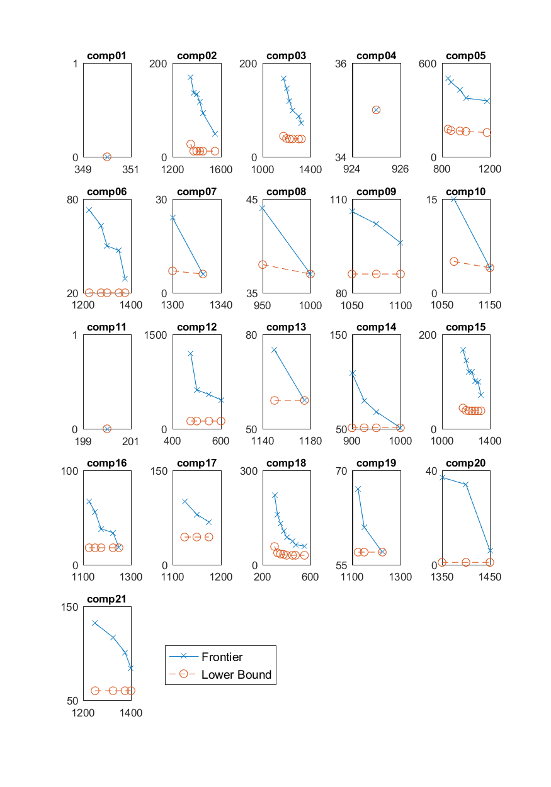
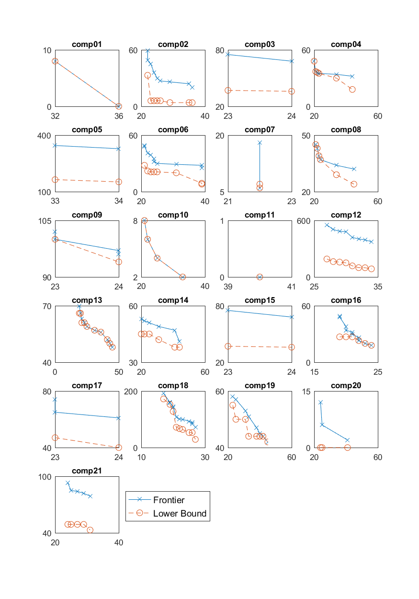
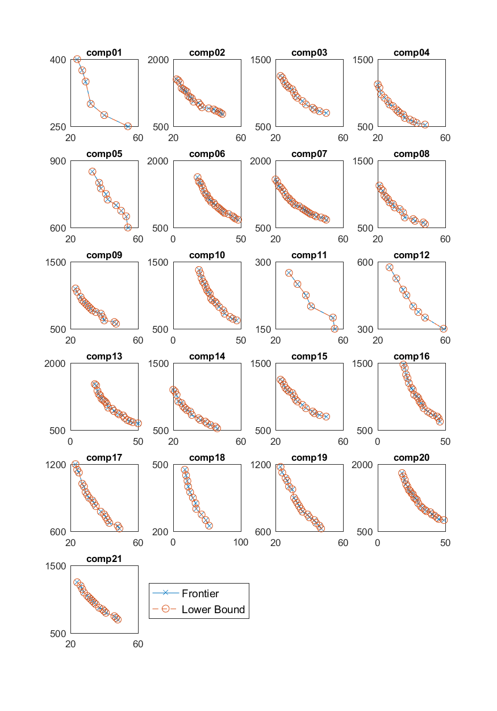
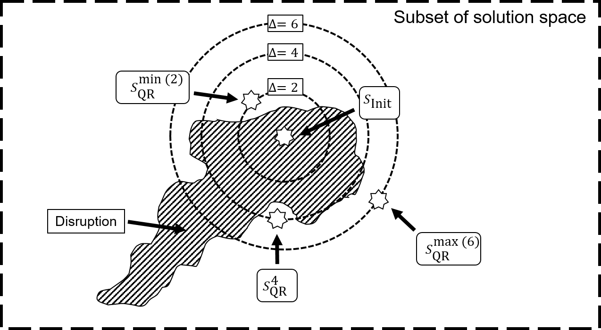

# University Timetabling
The purpose is to share code used for research in University Timetabling. It was used for my Ph.D. project, Strategic, Tactical and Operational University Timetabling. 

In science, researchers should be able to validate each other's results, which is difficult if the underlying source-code is not available for other researchers. Science is also about standing on the shoulders of giants, and re-implementing code takes a lot of effort for researchers. I hope this code can help other researchers see exactly how I obtained the results as well as help other there are going to implement similar things to get some ideas. 

The code is provided as-is with no warranty whatsoever. The code was made for research purposes under tight deadlines, and good coding practices have been second priority. In the nature of research does the code also contains many failed attempts of ideas that just didn't work. 

The program is made in C# and uses Gurobi as the mixed-integer programming solver. You can obtain an academic license for free at www.gurobi.com. The unit tests are made using n-unit.

The projects contains the following:
* A datareader and model for the Curriculum-Based Course timetabling from the ITC2007 competition. see http://www.cs.qub.ac.uk/itc2007/
* A Solution validator.
* A monolithic (3-index) mixed-integer model of Curriculum-based Course Timetabling from the ITC2007 competition.
* A two-stage (2-index) mixed-integer model. The model is based on the one by Lach & Lubbeche 2010.

## A strategic view on University Timetabling.
The purpose is to share the code made for the computational results for the article "A Strategic View on University Timetabling".
The results can be created by running the unit test MultiObjectiveTests.cs -> MultiObjSolveExhausted
This can be found in the code:
* Two additional strategic objectives described in the article: Total Room Capacity and number of Timeslots
* Implementation of Epsilon-method for bi-objective optimization.
* Implementation of Weighted-Sum method for bi-objective optimization.
* A linear algorithm to find a minimum number of rooms that should be used.
* An algorithm that can enumerate all feasible combinations of room for a certain total capacity.
Where trade off courves between quality and strategic measures can be generated.
 
<figure>

  <figcaption>Seats vs. quality</figcaption>
</figure>
 
<figure>

  <figcaption>Teaching Periods vs. quality</figcaption>
</figure>
 
<figure>

  <figcaption>Teaching Periods vs. Seats</figcaption>
</figure>
 
The purpose is to encourage future research in this direction and give researchers a possibility to validate the code and use it for inspiration to own research. 

## Quality Recovering of University Timetables
All results from the paper can be reproduced by running the unit test in MinimumPertubation.cs called QualityRecovering 
* An algorithm for Quality recover of University timetables
* A bi-objective method to find trade-off between perturbations and quality.
* generic framework to test different kinds of disruptions to the timetable.
* methods to track changes between two timetables.
* statistics of a large set of changes to get insights into structure of the timetable.

 
<figure>

  <figcaption>The figure shows a subset of the
solution space. The disruption makes a subspace of the solution space infeasible (grey
area), including the initial solution. The circles show two distances from the initial
solution. The minimum perturbation solution is the nearest feasible solution to the
initial solution. The quality recovering solutions is the one that is further away but has
higher quality.</figcaption>
</figure>

